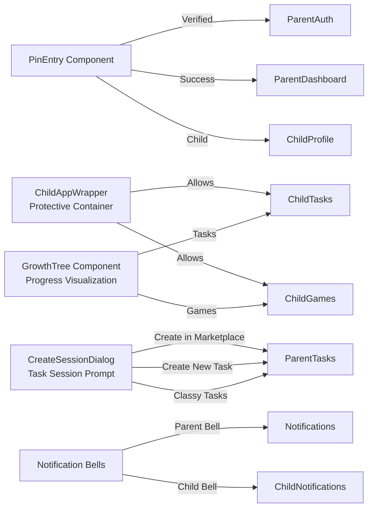
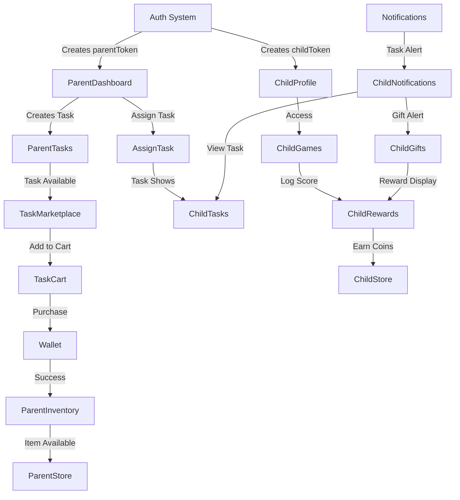

حلل بشكل اعمق وحدث خريطة كل المسارات# 🌐 Page Relationship Map — Classify
**خريطة العلاقات بين الصفحات (Routes) في مشروع Classify**

هذا المستند يقدّم خريطة شاملة لجميع صفحات المشروع (routes) والعلاقات بينها، بحيث أي مطور أو عضو جديد يقدر يفهم التنقّل والتحكم بمنتهى السرعة.

---

## 🧭 كيف يقرأ هذا الخريطة

* **Routes**: مسارات URL (مثل `/parent-dashboard`).
* **Page**: مكوّن React الذي يُحمّل عند الدخول إلى المسار.
* **Wrapper**: بعض الصفحات محاطة بـ `ChildAppWrapper` (لبيئة الطفل)، أو `ErrorBoundary` لضمان عدم تحطّم التطبيق.
* **Flow**: يشير إلى استخدام الصفحة في سياق معين (Parent flow, Child flow, Admin flow، إلخ).

---

## 🏠 الصفحة الرئيسية (Public)

| Route | Page | Wrapper/Notes | Flow |
|------|------|---------------|------|
| `/` | `Home` | `ErrorBoundary` | Public landing
| `/download` | `DownloadApp` | `ErrorBoundary` | Public landing
| `/parent-auth` | `ParentAuth` | `ErrorBoundary` | Auth flow (Parent)
| `/auth/oauth-callback` | `OAuthCallback` | `ErrorBoundary` | OAuth login callback
| `/forgot-password` | `ForgotPassword` | `ErrorBoundary` | Auth flow
| `/otp` | `OTPVerification` | `ErrorBoundary` | Auth flow (OTP)

---

## 👨‍👩‍👧 Parent Flow (Parent Dashboard)

هذا هو مسار الوالدين الأساسي. غالباً يتنقلون بين هذه الصفحات بعد تسجيل الدخول.

| Route | Page | Wrapper/Notes | Notes |
|------|------|---------------|-------|
| `/parent-dashboard` | `ParentDashboard` | `ErrorBoundary` | Main dashboard
| `/parent-store` | `ParentStore` | `ErrorBoundary` | متجر الوالد
| `/parent-inventory` | `ParentInventory` | `ErrorBoundary` | مخزون الوالد
| `/parent-tasks` | `ParentTasks` | `ErrorBoundary` | إدارة المهام
| `/task-marketplace` | `TaskMarketplace` | `ErrorBoundary` | سوق المهام (Teacher tasks)
| `/task-cart` | `TaskCart` | `ErrorBoundary` | سلة المهام
| `/assign-task` | `AssignTask` | `ErrorBoundary` | واجهة تعيين مهمة (ربط الطفل)
| `/subject-tasks` | `SubjectTasks` | `ErrorBoundary` | عرض مهام حسب المادة
| `/parent-profile` | `ParentProfile` | `ErrorBoundary` | إعدادات الوالد
| `/wallet` | `Wallet` | `ErrorBoundary` | محفظة الوالد
| `/notifications` | `Notifications` | `ErrorBoundary` | مركز الإشعارات
| `/subjects` | `Subjects` | `ErrorBoundary` | مراجعة المواد

---

## 🧒 Child Flow (Child App Wrapper)

كل صفحات الطفل محاطة بـ `ChildAppWrapper` الذي يضيف: نظام التحكّم بالصلاحيات، حراسة التوجيه، التوافق مع اللعب.

### 📌 Child App Wrapper Pages

| Route | Page | Notes |
|------|------|-------|
| `/child-games` | `ChildGames` | الألعاب (داخل wrapper)
| `/trial-games` | `TrialGames` | ألعاب تجريبية
| `/match3` | `Match3Page` | لعبة match3
| `/memory-match` | `MemoryMatchPage` | لعبة الذاكرة
| `/child-store` | `ChildStore` | متجر الطفل (token auth logic)
| `/child-gifts` | `ChildGifts` | الهدايا
| `/child-notifications` | `ChildNotifications` | إشعارات الطفل
| `/child-rewards` | `ChildRewards` | الجوائز والنقاط
| `/child-progress` | `ChildProgress` | التقدّم
| `/child-tasks` | `ChildTasks` | المهام
| `/child-profile` | `ChildProfile` | ملف الطفل
| `/child-settings` | `ChildSettings` | إعدادات الطفل
| `/child-discover` | `ChildDiscover` | اكتشف أطفال آخرين

### 🔐 Special Logic
- `/child-store` يتم التعامل معه بشكل مختلف: إذا ليس هناك `childToken` يُعرض الصفحة بدون wrapper.
- `ChildAppWrapper` يعزل الحالة الخاصة بالطفل (theme, auth, layout).

---

## 🛠 Admin Flow

| Route | Page | Notes |
|------|------|-------|
| `/admin` | `AdminAuth` | صفحة تسجيل دخول الادمن
| `/admin-dashboard` | `AdminDashboard` | لوحات التحكم الادمن
| `/admin/purchases` | `AdminPurchasesTab` | فواتير ومشتريات

---

## 🏫 Schools / Teachers / Libraries

### Schools
| Route | Page | Notes |
|------|------|-------|
| `/school/login` | `SchoolLogin` | تسجيل دخول المدرسة
| `/school/dashboard` | `SchoolDashboard` | لوحة المدرسة
| `/school/:id` | `SchoolProfile` | صفحة المدرسة العامة

### Teachers
| Route | Page | Notes |
|------|------|-------|
| `/teacher/login` | `TeacherLogin` | تسجيل دخول المعلم
| `/teacher/dashboard` | `TeacherDashboard` | لوحة المعلم
| `/teacher/:id` | `TeacherProfile` | صفحة المعلم العامة

### Libraries
| Route | Page | Notes |
|------|------|-------|
| `/library/login` | `LibraryLogin` | تسجيل المكتبة
| `/library/dashboard` | `LibraryDashboard` | لوحة المكتبة
| `/library/:id` | `LibraryProfile` | صفحة المكتبة العامة
| `/library-store` | `LibraryStore` | متجر المكتبات
| `/store/libraries` | redirect | يعيد التوجيه إلى `/library-store`

---

## 📝 Legal / Info / Static Pages

| Route | Page | Notes |
|------|------|-------|
| `/privacy` | `Privacy` | صفحة الخصوصية الأساسية
| `/privacy-policy` | `PrivacyPolicy` | صفحة سياسة الخصوصية المفصّلة
| `/terms` | `Terms` | الشروط والأحكام
| `/cookie-policy` | `CookiePolicy` | سياسة ملفات تعريف الارتباط
| `/accessibility` | `AccessibilityPolicy` | سياسة الوصول
| `/legal` | `LegalCenter` | مركز قانوني
| `/about` | `AboutUs` | من نحن
| `/contact` | `ContactUs` | تواصل معنا
| `/child-safety` | `ChildSafety` | سلامة الطفل
| `/refund-policy` | `RefundPolicy` | سياسة الاسترداد
| `/acceptable-use` | `AcceptableUse` | الاستخدام المقبول
| `/download` | `DownloadApp` | تحميل التطبيق

---

## 🔀 Cross-Linking & Redirects

### Redirect Routes
- `/register` → `/parent-auth`
- `/create-task` → `/parent-tasks`
- `/store/libraries` → `/library-store`

### Common Shared Component Flows
- **`ChildAppWrapper`**: يُستخدم لحماية صفحات الطفل من الوصول بدون توكن الطفل.
- **`ErrorBoundary`**: يلف معظم الصفحات لضمان عدم انهيار التطبيق وانعكاس الأخطاء.
- **`RandomAdPopup`**: يظهر بشكل عام في التطبيق (في App) ومرتبط بصفحات الألعاب والمتجر.

---

## � Complete Navigation Links (Extracted from Source Code)

### Component-Level Navigation
| Component | Links To | Purpose |
|-----------|----------|---------|
| **ChildAppWrapper** | `/child-tasks`, `/child-games` | Child app entry points |
| **ChildNotificationBell** | `/child-notifications` | Notification center (child) |
| **ChildPageLayout** | `/child-games` | Child page scaffold |
| **CreateSessionDialog** | `/parent-tasks?tab=marketplace`, `/parent-tasks?tab=my&create=1`, `/parent-tasks?tab=classy` | Session creation dialog |
| **GrowthTree** | `/child-games`, `/child-tasks` | Growth tracking UI |
| **NotificationBell** | `/notifications` | Notification center (parent) |
| **PinEntry** | `/parent-auth`, `/parent-dashboard`, `/child-profile` | PIN entry flow |

### Parent Flow - Complete Navigation Map
| From | Links To | Purpose |
|------|----------|---------|
| **Home** | `/parent-dashboard`, `/child-profile`, `/child-store`, `/child-link?action=existing`, `/child-link?action=new`, `/trial-games`, `/apps/*` | Main landing page hub |
| **ParentAuth** | `/otp`, `/teacher/dashboard`, `/school/dashboard`, `/library/dashboard`, `/`, `/parent-store`, `/forgot-password`, `/privacy-policy`, `/terms`, `/child-safety`, `/refund-policy`, `/about`, `/contact`, `/trial-games`, `/download`, `/legal` | Auth page with external links |
| **ParentDashboard** | `/`, `/parent-profile`, `/settings`, `/wallet`, `/parent-store`, `/parent-tasks`, `/subjects`, `/notifications`, `/assign-task`, `/parent-inventory`, `/parent-store?view=cart`, `/parent-store?view=orders` | Main dashboard hub |
| **ParentTasks** | `/parent-dashboard`, `/task-cart`, `/task-marketplace` | Tasks management |
| **ParentInventory** | `/parent-dashboard`, `/parent-store` | Item inventory |
| **Wallet** | `/parent-dashboard` | Payment/wallet view |
| **Notifications** | `/parent-dashboard` | Notification center |
| **Settings** | `/`, `/parent-dashboard`, `/teacher/login`, `/privacy-policy` | Settings page |
| **ParentProfile** | `/parent-auth`, `/parent-dashboard` | Profile settings |
| **Subjects** | `/parent-dashboard` | Subject management |
| **SubjectTasks** | `/parent-dashboard` | Subject-specific tasks |
| **TaskMarketplace** | `/parent-dashboard`, `/task-cart` | Task marketplace |
| **TaskCart** | `/task-marketplace`, `/wallet` | Cart checkout |
| **AssignTask** | `/parent-dashboard` | Task assignment |
| **OAuthCallback** | `/parent-dashboard`, `/parent-auth?error=oauth_no_token` | OAuth flow completion |

### Child Flow - Complete Navigation Map
| From | Links To | Purpose |
|------|----------|---------|
| **ChildLink** | `/parent-auth`, `/`, `/trial-games`, `/child-profile`, `/child-store` | Child onboarding/linking |
| **ChildProfile** | `/child-games`, `/child-discover`, `/child-store`, `/child-tasks`, `/child-progress` | Child profile hub |
| **ChildGames** | `/child-profile`, `/child-settings` | Game listing/launcher |
| **ChildTasks** | `/child-games` | Task view |
| **ChildNotifications** | `/child-gifts`, `/child-tasks`, `/child-games`, `/child-rewards`, `/child-progress`, `/child-settings` | Notification hub → multiple destinations |
| **ChildGifts** | `/child-games`, `/child-tasks` | Gift/reward display |
| **ChildRewards** | `/child-games` | Rewards view |
| **ChildProgress** | `/child-games`, `/child-tasks`, `/child-gifts` | Progress tracking |
| **ChildDiscover** | `/child-games` | Discover feature |
| **ChildSettings** | `/child-games`, `/child-profile` | Child settings |
| **TrialGames** | `/child-link` | Trial game mode |
| **Match3Page** | `/child-games` | Match3 game return |

### Admin & Institutional Flow
| From | Links To | Purpose |
|------|----------|---------|
| **AdminAuth** | `/admin-dashboard`, `/` | Admin login |
| **AdminDashboard** | `/admin` | Admin dashboard |
| **LibraryStore** | `/parent-auth`, `/parent-store` | Library store redirect |

### Legal & Static Pages
| From | Links To | Purpose |
|------|----------|---------|
| **Home** | `/` | Landing page |
| **AboutUs** | `/` | Return to home |
| **AcceptableUse** | `/` | Return to home |
| **AccessibilityPolicy** | `/settings` | Link to settings |
| **AccountDeletion** | `/` | Return to home |
| **CookiePolicy** | `/` | Return to home |
| **ContactUs** | `/` | Return to home |
| **ChildSafety** | `/` | Return to home |
| **ForgotPassword** | `/parent-auth` | Return to auth |
| **LegalCenter** | `/` | Return to home |
| **PrivacyPolicy** | `/` | Return to home |
| **RefundPolicy** | `/` | Return to home |
| **Terms** | `/` | Return to home |
| **DownloadApp** | `/`, `/parent-auth`, `/apps/*` | Download page hub |
| **not-found** | `/` | 404 fallback |

---

## �🔄 علاقة الصفحات ببعض (Use Cases)

### 1) تسجيل الدخول ثم تحويله للوضع الصحيح
- الوالد يزور `/parent-auth` → ينجح تسجيل الدخول → يتم إعادة توجيهه عادةً إلى `/parent-dashboard`
- الطفل يزور `/child-link` → يدخل رمز الربط → يتم إنشاء `childToken` → يُعاد توجيهه إلى `/child-tasks`

### 2) التنقل حسب الدور
- **والد**: غالباً ما يتنقل بين `/parent-dashboard`, `/parent-tasks`, `/parent-store`, `/wallet`, `/notifications`.
- **طفل**: غالباً ما يتنقل بين `/child-tasks`, `/child-games`, `/child-store`, `/child-garden`, `/child-profile`.
- **مدير**: يتنقل بين `/admin-dashboard`، `/admin/purchases`.

### 3) حالة الألعاب
- الروابط للألعاب (`/child-games`, `/match3`, `/memory-match`, `/trial-games`) كلها تحتوي على منطق لتوقيف حركة swipe-back (لعدم الخروج accidently)

---

## 🌀 Navigation Graph (Mermaid)

### 🔗 Complete Application Flow Map
```mermaid
flowchart TD
    Start([User Arrives]) --> Home[/ Home]
    
    Home -->|Parent Login| ParentAuth[/parent-auth]
    Home -->|Child Mode| ChildLink[/child-link]
    Home -->|Browse| TrialGames[/trial-games]
    Home -->|Browse| LegalPages["Legal/Static Pages"]
    Home -->|Browse| DownloadApp[/download]
    
    ParentAuth -->|Register/Forgot| ForgotPassword[/forgot-password]
    ParentAuth -->|OAuth Token| OAuthCallback[/oauth-callback]
    OAuthCallback -->|Success| ParentDashboard
    OAuthCallback -->|Error| ParentAuth
    ParentAuth -->|2FA| OTPVerification[/otp]
    OTPVerification -->|Verified| ParentDashboard[/parent-dashboard]
    
    ParentDashboard -->|Manage Tasks| ParentTasks[/parent-tasks]
    ParentDashboard -->|Shop| ParentStore[/parent-store]
    ParentDashboard -->|Inventory| ParentInventory[/parent-inventory]
    ParentDashboard -->|Payment| Wallet[/wallet]
    ParentDashboard -->|Check Messages| Notifications[/notifications]
    ParentDashboard -->|Profile| ParentProfile[/parent-profile]
    ParentDashboard -->|Settings| Settings[/settings]
    ParentDashboard -->|Subjects| Subjects[/subjects]
    ParentDashboard -->|Assign Task| AssignTask[/assign-task]
    
    ParentTasks -->|Browse Tasks| TaskMarketplace[/task-marketplace]
    ParentTasks -->|My Tasks| ParentTasks
    ParentTasks -->|Classy| ParentTasks
    TaskMarketplace -->|Add to Cart| TaskCart[/task-cart]
    TaskCart -->|Pay| Wallet
    
    ParentStore --> ParentStore
    ParentInventory -->|Browse Store| ParentStore
    
    Settings -->|Privacy| PrivacyPolicy[/privacy-policy]
    Settings -->|Teacher Mode| TeacherDashboard[/teacher/dashboard]
    
    ChildLink -->|New Child| ChildLink
    ChildLink -->|Existing Child| ChildLink
    ChildLink -->|Trial| TrialGames
    ChildLink -->|After Linking| ChildProfile[/child-profile]
    
    ChildProfile -->|Hub for Child| ChildProfile
    ChildProfile -->|Play Games| ChildGames[/child-games]
    ChildProfile -->|Do Tasks| ChildTasks[/child-tasks]
    ChildProfile -->|Shop| ChildStore[/child-store]
    ChildProfile -->|Discover| ChildDiscover[/child-discover]
    ChildProfile -->|Progress| ChildProgress[/child-progress]
    
    ChildGames -->|Play Match3| Match3[/match3]
    ChildGames -->|Play Memory| MemoryMatch[/memory-match]
    Match3 -->|Exit| ChildGames
    MemoryMatch -->|Exit| ChildGames
    
    ChildTasks -->|Back to Games| ChildGames
    ChildStore -->|Browse| ChildStore
    ChildProgress -->|View Stats| ChildProgress
    
    ChildNotifications[/child-notifications] -->|View Gifts| ChildGifts[/child-gifts]
    ChildNotifications -->|View Tasks| ChildTasks
    ChildNotifications -->|Games| ChildGames
    ChildNotifications -->|Rewards| ChildRewards[/child-rewards]
    ChildNotifications -->|Progress| ChildProgress
    ChildNotifications -->|Settings| ChildSettings[/child-settings]
    
    AdminAuth[/admin-auth] -->|Login Success| AdminDashboard[/admin-dashboard]
    AdminDashboard -->|Purchases| AdminPurchases["/admin/purchases"]
    
    LibraryStore[/library-store] -->|Browse| ParentStore
    TeacherDashboard["/teacher/dashboard"] -->|Back| ParentDashboard
    
    LegalPages -->|Return| Home
    DownloadApp -->|Download APK/PWA| DownloadApp
    DownloadApp -->|Continue| Home
    
    style Home fill:#e1f5ff
    style ParentDashboard fill:#fff3e0
    style ChildProfile fill:#f3e5f5
    style AdminDashboard fill:#ffe0b2
    style TrialGames fill:#e8f5e9
```

### 📌 Component-Level Navigation Flows


### 🔄 Data Flow - How Pages Connect



## ✨ Implementation Notes

### 1. Navigation is Generated from Source
- **Source**: `scripts/extract-navigation.cjs` — Automatically extracts all `navigate()`, `<Link>`, and `href` calls from React files.
- **Output**: `PAGE_NAVIGATION_LINKS.json` — Structured JSON map of all navigation edges.
- **Update Process**: Run `node scripts/extract-navigation.cjs` to regenerate the JSON anytime source code changes.

### 2. Wrappers & Guards
- **`ChildAppWrapper`**: Guards all child pages; validates `childToken` before rendering.
- **`ErrorBoundary`**: Wraps most pages to catch React errors and prevent full app crashes.
- **`ProtectedRoute`**: Some pages may have additional auth checks for parents/admins.

### 3. Query Params & State Management
- **`?tab=`** : Used to switch tabs within a page (e.g., `/parent-tasks?tab=marketplace`).
- **`?view=`** : Switch views (e.g., `/parent-store?view=cart`).
- **`?action=`** : Special actions (e.g., `/child-link?action=new`).
- **`?create=1`** : Flags for creation dialogs (e.g., `/parent-tasks?tab=my&create=1`).

### 4. Dynamic Routes
- **`/school/:id`** — School profile (dynamic ID).
- **`/teacher/:id`** — Teacher profile (dynamic ID).
- **`/library/:id`** — Library profile (dynamic ID).

### 5. 🚦 Navigation Patterns

#### Parent Auth → Dashboard Flow
```
Home → /parent-auth → (OTP if 2FA) → /parent-dashboard
```

#### Child Onboarding
```
Home → /child-link → (enter code) → /child-profile → /child-tasks
```

#### Task Purchase Journey
```
/parent-dashboard → /parent-tasks → /task-marketplace → /task-cart → /wallet
```

#### Child Game Play
```
/child-profile → /child-games → (/match3 or /memory-match) → /child-games
```

#### Notification to Action
```
ChildNotifications → (click link) → /child-tasks OR /child-gifts OR /child-rewards
```

---

## 📖 Using This Map

### For New Developers
1. **Understand the app structure**: Start with Home → ParentAuth → ParentDashboard or Home → ChildLink → ChildProfile.
2. **Find a page**: Search the tables above by route name.
3. **Check where it links to**: See "Links To" column to understand data flow.
4. **Check what links to it**: Use Ctrl+F to find pages linking to your target.

### For Designers/Product
1. **New feature flow**: Map the journey in the Mermaid diagrams above.
2. **Page placement**: Check the tables to ensure consistency with existing patterns.
3. **Linking strategy**: Always verify that back-navigation is available (e.g., pages should link back to dashboard or home).

### For DevOps/QA
1. **Test flows**: Use the "Use Cases" section to test complete user journeys.
2. **Regression checks**: After changes, verify all "Links To" still work as documented.
3. **Broken links**: Run the extractor script after commits to catch new navigation issues.

---

## 🔧 Maintenance

### To Update This Map
1. **Source code changes**: Any new `navigate()` or `<Link>` call requires running the extractor:
   ```bash
   node scripts/extract-navigation.cjs
   ```
2. **Verify output**: Check `PAGE_NAVIGATION_LINKS.json` for new edges.
3. **Update tables**: Add new links to the appropriate table(s) above.
4. **Commit together**: Commit code + updated map file to keep in sync.

### Problematic Patterns to Avoid
- ❌ Navigation via string concatenation (won't be detected by extractor).
- ❌ Dynamic routes without documentation (add to "Dynamic Routes" section).
- ❌ Conditional redirects in `useEffect` (document separately in code comments).
- ❌ Window.location changes (prefer `navigate()` for SPA consistency).

---

## 📞 Questions?

- **"How do I get from X to Y?"** → Search tables for X, check "Links To".
- **"What pages link to page Z?"** → Search tables for Z in "Links To" column.
- **"Is this route protected?"** → Check if it's wrapped by `ChildAppWrapper`, `ErrorBoundary`, or has auth guards.
- **"Why is a page not in this map?"** → Either it's not accessible via navigation (direct URL) or it's a game embedded in an iframe.
2. **تعرّف الدور** (Parent/Child/Admin/School/Teacher/Library).
3. **تابع الـ Wrapper** (مثل `ChildAppWrapper`) لفهم حالة المستخدم.
4. **افهم ما هو Next** (أي صفحات يمكن التنقل إليها من داخل الصفحة).

---

## 🧠 تحليل أعمق: روابط التنقل الداخلية (Link / navigate)

### 📌 روابط ثابتة داخل الكود (Fixed-links)
تتم بواسطة `Link` أو `href` أو `navigate()`.

#### من `Home` (الصفحة الرئيسية)
- ***navigate***:
  - `/parent-auth`
  - `/parent-dashboard`
  - `/child-profile`
  - `/child-store`
  - `/child-link?action=existing`
  - `/child-link?action=new`
  - `/trial-games`

- ***روابط تنزيل***:
  - `/apps/classify-googleplay-latest.aab`
  - `/apps/classify-pwa-latest.zip`

#### من `ParentAuth`
- روابط سريعة (Footer links):
  - `/privacy-policy`
  - `/terms`
  - `/child-safety`
  - `/refund-policy`
  - `/about`
  - `/contact`
  - `/trial-games`
  - `/download`
  - `/legal`

---

## 🧭 كل المسارات (Full Route List)

### ✅ Public & Auth
- `/`
- `/download`
- `/parent-auth`
- `/auth/oauth-callback`
- `/forgot-password`
- `/otp`

### 🧑‍💼 Parent Flow
- `/parent-dashboard`
- `/parent-store`
- `/parent-inventory`
- `/parent-tasks`
- `/task-marketplace`
- `/task-cart`
- `/assign-task`
- `/subject-tasks`
- `/parent-profile`
- `/wallet`
- `/notifications`
- `/subjects`
- `/settings`

### 🧒 Child Flow
- `/child-games`
- `/trial-games`
- `/match3`
- `/memory-match`
- `/child-store`
- `/child-gifts`
- `/child-notifications`
- `/child-rewards`
- `/child-progress`
- `/child-tasks`
- `/child-profile`
- `/child-settings`
- `/child-discover`
- `/child-public-profile/:shareCode`

### 🛠 Admin
- `/admin`
- `/admin-dashboard`
- `/admin/purchases`

### 🏫 Schools / Teachers / Libraries
- `/school/login`
- `/school/dashboard`
- `/school/:id`
- `/teacher/login`
- `/teacher/dashboard`
- `/teacher/:id`
- `/library/login`
- `/library/dashboard`
- `/library/:id`
- `/library-store`

### 📝 Legal / Info
- `/privacy`
- `/privacy-policy`
- `/terms`
- `/cookie-policy`
- `/accessibility`
- `/legal`
- `/about`
- `/contact`
- `/child-safety`
- `/refund-policy`
- `/acceptable-use`

---

## 📌 ملخص الروابط الداخليّة (Internal navigation edges)

| Source Page | Links to | كيف (Link/Navigate) |
|-------------|----------|---------------------|
| `Home` | `/parent-auth`, `/parent-dashboard`, `/child-profile`, `/child-store`, `/child-link`, `/trial-games` | `navigate()` calls
| `ParentAuth` | `/privacy-policy`, `/terms`, `/child-safety`, `/refund-policy`, `/about`, `/contact`, `/trial-games`, `/download`, `/legal` | `<Link href=...>`

---

## ✅ كيف تحسّن الخريطة أكثر؟
- يمكننا استخراج المزيد من الروابط الديناميكية (مثل روابط `school/:id`, `teacher/:id`) عبر تحليل `Link href={...}` و`navigate()` في الصفحات الأخرى.
- يمكننا إنشاء مخطط Mermaid كامل لكل الـ components الأساسية (Navbar, Footer, Menu) التي تطلق التنقل.

---

**آخر تحديث**: مارس 19 2026
